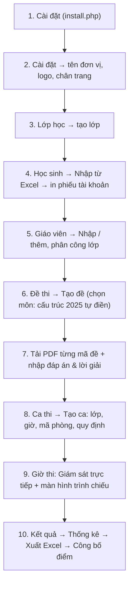
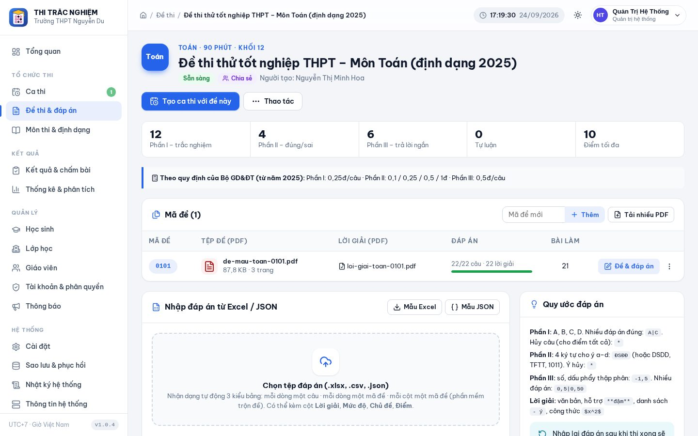
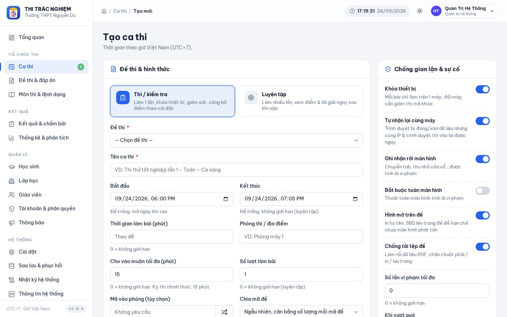
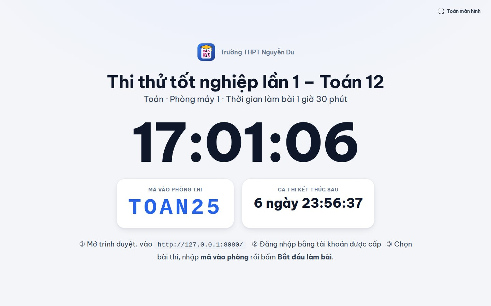
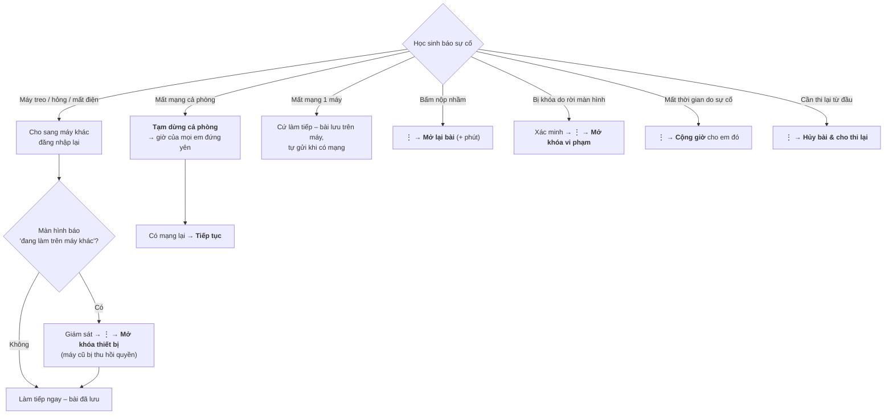
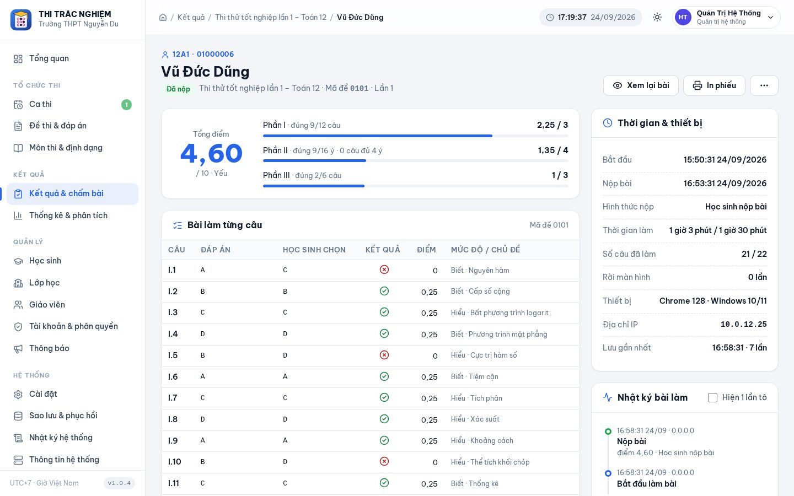
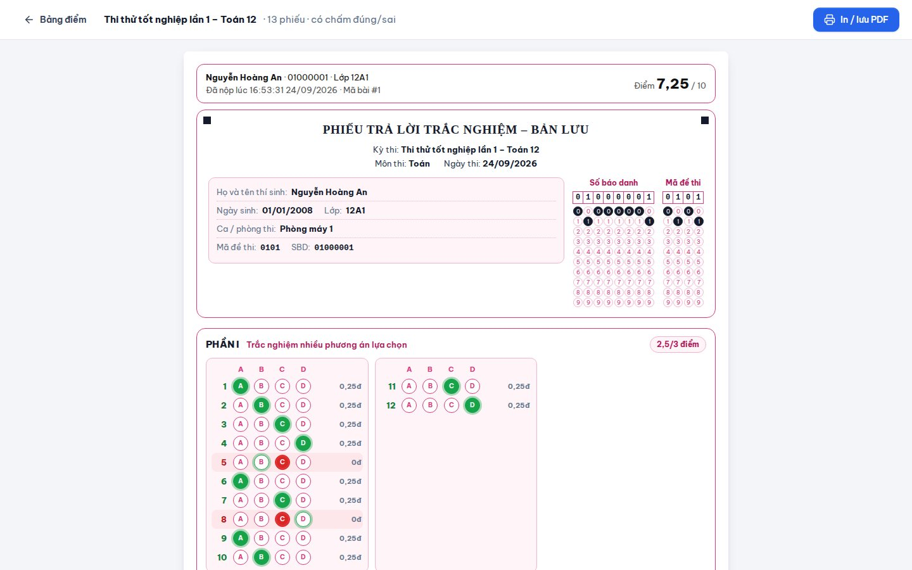
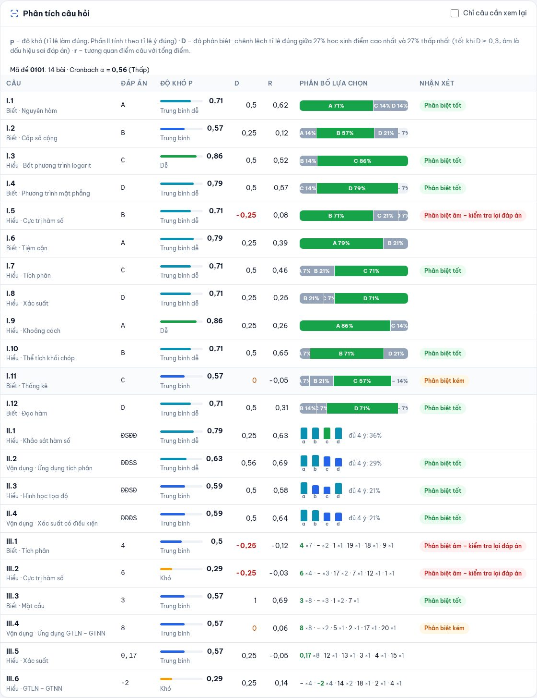
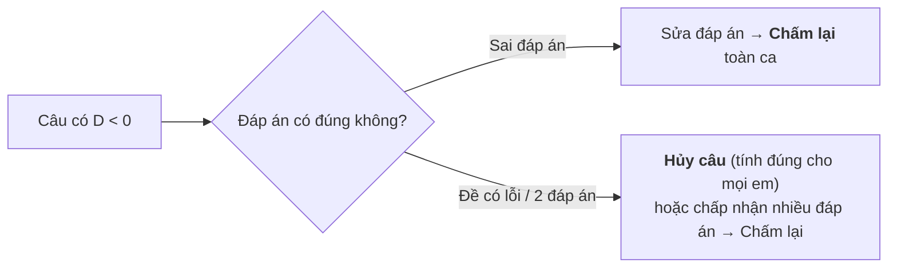
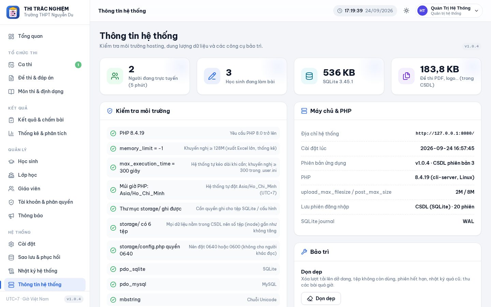

# 📘 Hướng dẫn sử dụng – Hệ thống thi trắc nghiệm trực tuyến (định dạng 2025)

> Tài liệu dành cho **quản trị viên, giáo viên, giám thị và học sinh**. Mọi thời gian trong hệ thống là **giờ Việt Nam (UTC+7)**.
> Quay lại [README](../README.md) để xem phần cài đặt và kiến trúc.

## Mục lục

1. [Vai trò & quyền hạn](#1-vai-trò--quyền-hạn)
2. [Bắt đầu nhanh trong 10 bước](#2-bắt-đầu-nhanh-trong-10-bước)
3. [Lớp học, học sinh, giáo viên](#3-lớp-học-học-sinh-giáo-viên)
4. [Môn thi & định dạng đề](#4-môn-thi--định-dạng-đề)
5. [Đề thi, mã đề, đáp án & lời giải](#5-đề-thi-mã-đề-đáp-án--lời-giải)
6. [Tạo ca thi](#6-tạo-ca-thi)
7. [Giám sát trong giờ thi & xử lý sự cố](#7-giám-sát-trong-giờ-thi--xử-lý-sự-cố)
8. [Dành cho học sinh: làm bài thi](#8-dành-cho-học-sinh-làm-bài-thi)
9. [Kết quả, chấm tự luận, in phiếu, xuất Excel](#9-kết-quả-chấm-tự-luận-in-phiếu-xuất-excel)
10. [Thống kê & phân tích câu hỏi](#10-thống-kê--phân-tích-câu-hỏi)
11. [Cài đặt hệ thống, thông báo](#11-cài-đặt-hệ-thống-thông-báo)
12. [Sao lưu, phục hồi, bảo trì](#12-sao-lưu-phục-hồi-bảo-trì)
13. [Câu hỏi thường gặp](#13-câu-hỏi-thường-gặp)

---

## 1. Vai trò & quyền hạn

| Chức năng | Quản trị | Giáo viên | Giám thị | Học sinh |
|---|:---:|:---:|:---:|:---:|
| Tổng quan, thông báo | ✅ | ✅ | ✅ | xem thông báo |
| Học sinh, lớp | toàn trường | lớp được phân công | — | — |
| Giáo viên, tài khoản, phân quyền | ✅ | — | — | — |
| Môn thi & định dạng đề | ✅ | — | — | — |
| Đề thi, mã đề, đáp án | tất cả | đề của mình + đề được chia sẻ | — | — |
| Tạo ca thi | tất cả | ca của mình | — | — |
| Giám sát, cộng giờ, mở khóa, thu bài | ✅ | ca của mình | ca được phân công | — |
| Kết quả, chấm tự luận, chấm lại | ✅ | ca / lớp của mình | — | xem điểm của mình |
| Thống kê, xuất Excel | ✅ | ✅ | — | — |
| Cài đặt, sao lưu, nhật ký | ✅ | — | — | — |
| Làm bài thi, luyện tập | — | — | — | ✅ |

Quản trị viên có thể **tạo vai trò mới** (ví dụ *Tổ trưởng chuyên môn*, *Cán bộ khảo thí*) và tick từng quyền trong **Tài khoản & phân quyền → Vai trò & quyền**.

---

## 2. Bắt đầu nhanh trong 10 bước



> 💡 Khi cài đặt, tick **Tạo dữ liệu mẫu** để có ngay 2 lớp, 20 học sinh, đề Toán minh họa (PDF + đáp án + lời giải) và một ca thi đang mở để thử toàn bộ quy trình.

---

## 3. Lớp học, học sinh, giáo viên

### 3.1. Lớp học
**Quản lý → Lớp học → Thêm lớp**: tên lớp (`12A1`), khối, năm học, giáo viên chủ nhiệm, các giáo viên bộ môn. Giáo viên được phân công sẽ thấy học sinh, kết quả của lớp đó.

### 3.2. Nhập học sinh từ Excel


1. **Học sinh → Nhập từ Excel**. Tải *tệp mẫu* nếu cần ([mẫu tại đây](samples/mau-nhap-hoc-sinh.xlsx)).
2. Chọn tệp `.xlsx` hoặc `.csv` → hệ thống **tự nhận dạng cột** (không cần đúng thứ tự) và hiển thị **bản xem trước**: dòng lỗi, trùng tài khoản, lớp mới sẽ được tạo.
3. Chọn cách đặt **tên đăng nhập** (theo mã HS / họ tên + lớp / giữ nguyên trong tệp) và **mật khẩu** (ngẫu nhiên / theo ngày sinh / cố định).
4. Bấm **Nhập** → tải **danh sách tài khoản** (Excel) hoặc **in phiếu tài khoản** để cắt phát cho học sinh.

| Cột được nhận dạng | Tên cột có thể dùng |
|---|---|
| Họ và tên \* | `Họ và tên`, `Họ tên`, hoặc 2 cột `Họ đệm` + `Tên` |
| Mã học sinh / SBD | `Mã HS`, `Mã học sinh`, `SBD`, `Số báo danh`, `Mã định danh` |
| Lớp | `Lớp`, `Tên lớp` (lớp chưa có sẽ được tạo) |
| Ngày sinh | `Ngày sinh` – nhận `dd/mm/yyyy`, `yyyy-mm-dd`, ô ngày của Excel |
| Giới tính | `Giới tính`, `Nữ` (đánh dấu x) |
| Tên đăng nhập, mật khẩu, email, điện thoại, ghi chú | (tùy chọn) |

✔️ Họ tên được **chuẩn hóa tự động** (`lê hoàng  châu` → `Lê Hoàng Châu`), sắp xếp **theo tên** đúng kiểu Việt Nam.

### 3.3. Giáo viên
**Quản lý → Giáo viên**: thêm từng người hoặc nhập Excel ([mẫu](samples/mau-nhap-giao-vien.xlsx)) với các cột *Họ và tên, Mã GV, Môn, Lớp chủ nhiệm, Lớp dạy, Vai trò…*

### 3.4. Tài khoản
- **Cấp lại mật khẩu**, **khóa / mở khóa**, **đăng xuất khỏi mọi thiết bị** ngay trong trang học sinh / tài khoản.
- Có thể bắt học sinh **đổi mật khẩu lần đầu** đăng nhập.

---

## 4. Môn thi & định dạng đề

**Tổ chức thi → Môn thi & định dạng** có sẵn cấu trúc đề thi tốt nghiệp từ năm 2025:

| Môn | Phần I (0,25 đ/câu) | Phần II (tối đa 1 đ/câu) | Phần III | Thời gian |
|---|---|---|---|---|
| Toán | 12 câu | 4 câu | 6 câu × 0,5 đ | 90 phút |
| Vật lí, Hóa học, Sinh học, Địa lí | 18 câu | 4 câu | 6 câu × 0,25 đ | 50 phút |
| Lịch sử, GDKT&PL, Tin học, Công nghệ | 24 câu | 4 câu | — | 50 phút |
| Tiếng Anh, Pháp, Trung, Nhật, Hàn, Đức, Nga | 40 câu | — | — | 50 phút |
| Ngữ văn | — | — | tự luận (Đọc hiểu 4 đ + Viết 6 đ) | 120 phút |

Có thể sửa số câu, thêm **câu tự luận**, đổi **độ dài ô trả lời ngắn** (mặc định 4 ký tự như phiếu của Bộ), và chọn **cách tính điểm**:

| Cách tính | Mô tả |
|---|---|
| **Theo quy định Bộ GD&ĐT 2025** | Phần I 0,25 đ; Phần II đúng 1/2/3/4 ý = 0,1/0,25/0,5/1 đ; Phần III 0,5 đ (Toán) hoặc 0,25 đ |
| **Tùy chỉnh** | Tự đặt điểm từng phần, trừ điểm câu sai, bảng điểm Phần II riêng hoặc tính theo từng ý, quy về thang điểm bất kỳ |
| **Theo tỉ lệ** | Điểm = số câu/ý đúng ÷ tổng × thang điểm |

Tùy chọn chung: **làm tròn** (0,01 / 0,05 / 0,1 / 0,25 / 0,5 / 1), **không cho điểm âm**, so sánh Phần III **theo giá trị số** (`0,5` = `,5` = `0,50`) hoặc **đúng từng ký tự**.

---

## 5. Đề thi, mã đề, đáp án & lời giải



### 5.1. Tạo đề & tải PDF
1. **Đề thi & đáp án → Tạo đề**: chọn môn (cấu trúc tự điền), tên đề, thời gian, có **chia sẻ** cho giáo viên khác không.
2. Thêm **mã đề** (`0101`, `0102`…) – hoặc nhập đáp án nhiều mã đề một lần, hệ thống tự tạo mã đề.
3. Mỗi mã đề: **Tải PDF đề** và (tùy chọn) **PDF lời giải**. Tệp được tải theo từng khúc 512 KB nên **không vướng giới hạn tải lên của hosting**, và được **lưu trong CSDL**.

> Có thể tổ chức thi **đề giấy**: không tải PDF, học sinh chỉ tô phiếu trả lời trên máy.

### 5.2. Nhập đáp án


**Cách 1 – Soạn trực tiếp**: mở *Đáp án* của mã đề → màn hình 2 cột (đề PDF | phiếu) → bấm ô tròn để chọn đáp án đúng. Biểu tượng ✏️ ở mỗi câu để nhập **lời giải chi tiết, điểm riêng, mức độ, chủ đề, câu gốc** hoặc **hủy câu**. Nút **Nhập nhanh** cho phép gõ `ABCDBACDABCD` cho cả Phần I. Phím tắt `Ctrl + S` để lưu.

**Cách 2 – Excel** ([mẫu](samples/mau-dap-an-toan.xlsx)). Hệ thống tự nhận dạng 3 kiểu bảng:

| Kiểu | Hình dạng | Ví dụ |
|---|---|---|
| **A. Dọc** – mỗi dòng 1 câu | `Mã đề · Phần · Câu · Đáp án · Điểm · Mức độ · Chủ đề · Câu gốc · Lời giải` | `0101 · I · 1 · A` / `0101 · II · 1 · ĐSĐĐ` / `0101 · III · 1 · -1,5` |
| **B. Ngang** – mỗi dòng 1 mã đề | `Mã đề · I.1 · I.2 · … · II.1 · … · III.6` | `0101 · A · B · … · ĐSĐĐ · … · 0,17` |
| **C. Bảng** – mỗi cột 1 mã đề (kiểu phần mềm trộn đề xuất ra) | `Câu · 0101 · 0102 · 0103…` | `1 · A · C · B` |

Quy ước đáp án:
- **Phần I**: `A`/`B`/`C`/`D`; nhiều đáp án đúng: `AB`; hủy câu: `*`.
- **Phần II**: 4 ký tự theo ý a–d: `Đ`/`D`/`1`/`T` = đúng, `S`/`0`/`F` = sai → ví dụ `ĐSĐĐ`, `1011`, `TFTT`. Hoặc 4 dòng a), b), c), d) riêng.
- **Phần III**: số thập phân dùng dấu phẩy hoặc chấm (`-1,5`, `0.17`); nhiều đáp án chấp nhận: `1,5|1,50`.

**Cách 3 – JSON** ([ví dụ đầy đủ](samples/dap-an-mau-toan.json)), dạng gọn:

```json
{
  "variants": [
    { "code": "0101",
      "p1": "ABCDBACDABCD",
      "p2": ["DSDD", "DDSS", "DDSD", "DDDS"],
      "p3": ["4", "6", "3", "8", "0,17", "-2"],
      "explanations": { "p1": { "1": "Ta có $\\int (3x^2+1)dx = x^3+x+C$. Chọn **A**." } } }
  ]
}
```

Sau khi nhập, hệ thống hiển thị **bản xem trước**: số câu mỗi mã đề, câu thiếu, đáp án sai quy cách, cảnh báo đánh số lại.

### 5.3. Lời giải chi tiết
Lời giải viết dạng văn bản có định dạng đơn giản: `**in đậm**`, `*nghiêng*`, danh sách `- …`, ảnh ``, **công thức toán** `$x^2$`, `$$\int_0^1 f(x)dx$$` (hiển thị bằng KaTeX). Học sinh xem ở trang **Xem lại bài** nếu ca thi cho phép.

---

## 6. Tạo ca thi



**Ca thi → Tạo ca thi** (hoặc *Tạo ca luyện tập* – học sinh làm lại nhiều lần, xem điểm & lời giải ngay):

| Nhóm | Tùy chọn |
|---|---|
| Cơ bản | Đề thi, tên ca, phòng thi, **mã vào phòng** (giám thị đọc tại chỗ), lớp dự thi + học sinh thêm lẻ theo tên đăng nhập / mã, giám thị phụ trách |
| Thời gian | Giờ mở – giờ đóng, thời gian làm bài (mặc định theo đề), **cho vào muộn tối đa X phút**, chính sách: *không vượt giờ đóng ca* hoặc *luôn đủ thời gian*, thời gian ân hạn khi hết giờ |
| Mã đề | Ngẫu nhiên cân bằng số lượng / lần lượt / cố định một mã |
| Lượt làm | Số lượt tối đa (0 = không giới hạn), lấy điểm lần **cao nhất / mới nhất / đầu tiên** |
| Chống gian lận | Khóa thiết bị, tự nhận lại cùng máy, ghi nhận rời màn hình, bắt buộc toàn màn hình, số lần rời màn hình tối đa → *ghi nhận / tạm khóa / tự thu bài*, in chìm đề, chống tải PDF, nộp bài sớm nhất sau X phút |
| Kết quả | Khi nào học sinh **xem điểm** (ngay / sau ca thi / khi công bố / không), khi nào **xem lại bài**, có hiện đáp án / lời giải / PDF lời giải không |

Trong trang ca thi có các nút: **Bắt đầu ngay**, **Tạm dừng cả phòng**, **Cộng giờ cả phòng**, **Gửi thông báo**, **Kết thúc & thu bài**, **Công bố điểm**.

---

## 7. Giám sát trong giờ thi & xử lý sự cố


Mở **Ca thi → Giám sát** (tự cập nhật vài giây/lần):
- Số học sinh **đang làm (có kết nối)**, **mất kết nối**, **chưa vào**, **đã nộp**, **có rời màn hình**.
- Hộp **cảnh báo cần xử lý**: máy khác đang cố vào bài, bị khóa do vi phạm, mất kết nối lâu – có nút xử lý ngay.
- Mỗi học sinh: tiến độ, thời gian còn lại, số lần rời màn hình, thiết bị & IP, điểm (khi nộp); menu **⋮** để *cộng / bớt giờ, nhắn tin riêng, tạm dừng / tiếp tục, mở khóa thiết bị, mở khóa vi phạm, thu bài, mở lại bài, hủy bài cho thi lại*.
- Chọn nhiều học sinh để thao tác hàng loạt; lọc *Cần xử lý*; tìm theo tên / SBD.
- **Màn hình trình chiếu** (nút góc trên): đồng hồ giờ máy chủ, **mã vào phòng**, thời gian còn lại của ca – chiếu lên máy chiếu cho cả phòng.



### Sơ đồ xử lý sự cố



> 🔎 Mọi thao tác của học sinh và giám thị đều nằm trong **nhật ký bài làm** (*Kết quả → Chi tiết bài làm*): lúc vào thi, từng lần tô / đổi đáp án, rời màn hình, đổi máy, được cộng giờ… dùng khi giải quyết khiếu nại.

---

## 8. Dành cho học sinh: làm bài thi

### 8.1. Trước giờ thi
1. Đăng nhập bằng tài khoản được phát.
2. Trang **Bài thi của em** hiện các bài đang mở, sắp diễn ra (đếm ngược), đã làm.
3. Bấm **Vào phòng thi** → đọc **quy định phòng thi**, xem **Kiểm tra máy** (trình duyệt, kết nối, đồng hồ) → nhập **mã vào phòng** (nếu có) → tick cam kết → **Bắt đầu làm bài**.


### 8.2. Trong giờ thi

| Thao tác | Cách làm |
|---|---|
| Chọn đáp án Phần I | Bấm ô tròn A/B/C/D (bấm lại để bỏ). Bàn phím: `A` `B` `C` `D` hoặc `1`–`4`, `↑` `↓` chuyển câu |
| Phần II | Mỗi ý a), b), c), d) chọn **Đúng** hoặc **Sai** |
| Phần III | Tô từ trái sang phải: dấu `−` chỉ ở cột đầu, dấu phẩy ở cột 2 hoặc 3; hoặc **bấm vào dãy ô kết quả để gõ** (ví dụ `-1,5`). Tô sai quy cách sẽ có cảnh báo đỏ |
| Đánh dấu xem lại | Biểu tượng 🚩 hoặc phím `F`; lọc *Chưa làm* / 🚩 ở đầu phiếu |
| Đổi độ rộng 2 cột | Kéo thanh chia giữa (phím `←` `→`), bấm đúp để về mặc định, nút `«` `»` để thu gọn |
| Phóng to đề | `Ctrl` + lăn chuột trên đề, hoặc chọn tỉ lệ; nút 🌙 đọc nền tối |
| Trạng thái lưu | Góc trên: *Đã lưu* · *Đang lưu* · *Mất mạng · đã lưu trên máy* |
| Nộp bài | Nút **Nộp bài** → hệ thống liệt kê câu chưa làm, câu đánh dấu, câu tô sai quy cách → xác nhận |


Trên **điện thoại / máy tính bảng**, đề và phiếu chuyển thành 2 tab *Đề thi* – *Phiếu trả lời*:


### 8.3. Khi có sự cố – em cần nhớ
- **Mất mạng**: cứ làm tiếp, bài lưu trên máy và tự gửi khi có mạng.
- **Máy treo, mất điện**: báo giám thị, đăng nhập lại (ở máy khác nếu cần) → vào lại bài thi → bài vẫn còn.
- **Hiện hộp đăng nhập lại**: nhập mật khẩu là làm tiếp, thời gian không bị mất.
- **Không rời khỏi màn hình làm bài** (chuyển tab, mở ứng dụng khác) – mọi lần rời đi đều bị ghi nhận.
- Hết giờ, bài **tự động nộp**.


### 8.4. Sau khi nộp
- Trang **Kết quả**: điểm, xếp loại, điểm từng phần, số câu đúng (nếu ca thi cho xem).
- **Xem lại bài**: đề bên trái, phiếu bên phải tô **xanh** (đúng) / **đỏ** (sai), viền xanh là đáp án đúng, bấm 💡 để xem **lời giải chi tiết**.
- **Luyện tập**: làm lại nhiều lần, hệ thống lưu điểm cao nhất; **Kết quả & lịch sử** lưu toàn bộ bài đã làm.


---

## 9. Kết quả, chấm tự luận, in phiếu, xuất Excel


- **Kết quả & chấm bài → chọn ca thi**: bảng điểm cả lớp **kể cả học sinh vắng**, điểm từng phần, thời gian làm, số lần rời màn hình; lọc *Đã nộp / Vắng / Đang làm / Chờ chấm*; sắp theo danh sách hoặc theo điểm.
- **Chi tiết bài làm**: đáp án – học sinh chọn – đúng/sai từng câu, thời gian & thiết bị, **nhật ký đầy đủ**; nút *Xem lại bài* (giống màn hình học sinh), *In phiếu*, *Chấm lại*, *Mở lại*, *Hủy bài*.



- **Chấm tự luận**: nhập điểm từng câu (có hướng dẫn chấm), nhận xét → **Lưu & chấm bài tiếp** để chuyển nhanh sang bài chờ chấm kế tiếp.
- **Chấm lại** (toàn ca hoặc bài chọn): dùng sau khi sửa đáp án, hủy câu, đổi cách tính điểm.
- **In phiếu trả lời (bản lưu)**: mỗi học sinh 1 trang A4, có hoặc không tô đúng/sai – dùng lưu hồ sơ hoặc trả bài.



- **Xuất Excel** gồm 4 trang:
  1. **Kết quả** – SBD, họ tên, ngày sinh, lớp, mã đề, thời gian, điểm từng phần, tổng, xếp loại (có lọc, cố định dòng tiêu đề);
  2. **Chi tiết từng câu** – đáp án của từng mã đề và lựa chọn của từng học sinh, tô xanh/đỏ;
  3. **Thống kê** – chỉ số, xếp loại, phổ điểm, theo lớp;
  4. **Phân tích câu hỏi** – p, D, r, phân bố lựa chọn, nhận xét.
- **Công bố điểm**: khi ca thi đặt chế độ *xem điểm khi giáo viên công bố*.

---

## 10. Thống kê & phân tích câu hỏi


**Thống kê & phân tích → chọn ca thi** (lọc theo lớp):
- Điểm trung bình, trung vị, độ lệch chuẩn, tỉ lệ ≥ 5 và ≥ 8, **độ tin cậy của đề (Cronbach α)**.
- **Phổ điểm** theo mức 0,5 điểm (giống phổ điểm Bộ công bố), **xếp loại**, **so sánh lớp**, tỉ lệ điểm theo **từng phần**, theo **mức độ nhận thức** và **chủ đề** (nếu nhập kèm đáp án).
- Danh sách **học sinh điểm cao** và **cần hỗ trợ thêm**.



### Đọc bảng phân tích câu hỏi

| Chỉ số | Ý nghĩa | Cách đọc |
|---|---|---|
| **p** – độ khó | Tỉ lệ học sinh làm đúng (Phần II tính theo tỉ lệ ý đúng) | ≥ 0,8 dễ · 0,4–0,8 trung bình · ≤ 0,2 rất khó |
| **D** – độ phân biệt | Tỉ lệ đúng của 27% học sinh điểm cao **trừ** 27% điểm thấp | ≥ 0,4 rất tốt · 0,3–0,4 tốt · 0,2–0,3 tạm · < 0,2 kém · **âm → nghi sai đáp án** |
| **r** – tương quan điểm câu | Câu làm đúng có đi cùng tổng điểm cao không | ≥ 0,3 tốt; gần 0 hoặc âm cần xem lại |
| **Phân bố lựa chọn** | % học sinh chọn A/B/C/D/bỏ trống (ô xanh là đáp án) | Phương án nhiễu hút nhiều hơn đáp án → kiểm tra lại đáp án / đề |
| **Cronbach α** | Độ nhất quán nội tại của cả đề | ≥ 0,8 cao · 0,7–0,8 chấp nhận được · < 0,6 thấp |



---

## 11. Cài đặt hệ thống, thông báo


**Hệ thống → Cài đặt**:

| Nhóm | Nội dung |
|---|---|
| Nhận diện & giao diện | Tên hệ thống, tên ngắn cạnh logo, tên đơn vị, cơ quan chủ quản, **chân trang / bản quyền** (dùng `{year}`, `{org}`, liên kết `[chữ](https://…)`), **màu chủ đạo**, tiêu đề & thông báo trang đăng nhập, **logo** và **favicon** (ảnh được thu nhỏ trên trình duyệt rồi lưu vào CSDL) |
| Mặc định thi cử | Giá trị mặc định khi tạo ca thi mới: xem điểm, xem lại bài, khóa thiết bị, tự nhận lại cùng máy, toàn màn hình, số lần rời màn hình, in chìm, mã hóa PDF, thời gian ân hạn, độ trễ lưu, nhịp kiểm tra kết nối |
| Xếp loại | Ngưỡng Giỏi / Khá / Trung bình / Yếu (thang 10, tự quy đổi) |
| Bảo mật | Số lần sai mật khẩu, thời gian khóa, giới hạn theo IP (phòng máy chung IP nên để cao), thời gian giữ phiên, độ dài mật khẩu tối thiểu, học sinh tự đổi mật khẩu |
| Bảo trì | Bật chế độ bảo trì (chỉ quản trị đăng nhập được) và nội dung thông báo |

**Quản lý → Thông báo**: đăng thông báo cho *mọi người / học sinh / giáo viên / một lớp*, ghim lên đầu, đặt thời gian hiển thị. Học sinh thấy ở trang chủ, giáo viên thấy ở trang tổng quan.

---

## 12. Sao lưu, phục hồi, bảo trì


- **Sao lưu**: *Hệ thống → Sao lưu & phục hồi → Tải bản sao lưu (.tnbak)* – chứa **toàn bộ dữ liệu** (tài khoản, đề PDF, đáp án, bài làm, cài đặt, logo, tùy chọn kèm nhật ký). Nên tải sau mỗi đợt thi.
- Với SQLite: **Tải tệp .sqlite** (mở được bằng *DB Browser for SQLite*).
- **Phục hồi**: chọn tệp `.tnbak` → kiểm tra thông tin bản sao lưu → gõ `PHỤC HỒI` để xác nhận → theo dõi thanh tiến trình. Sau khi xong, mọi người phải đăng nhập lại.
- **Chuyển SQLite ↔ MySQL / đổi hosting**: sao lưu ở hệ thống cũ → cài mới (chọn loại CSDL mong muốn) → phục hồi.

**Hệ thống → Thông tin hệ thống**: kiểm tra phiên bản PHP, tiện ích, giới hạn của hosting, dung lượng CSDL, số người trực tuyến; các nút **Dọn dẹp** (tải lên dở dang, tệp không dùng, phiên hết hạn, nhật ký cũ), **Tối ưu CSDL**, **Xóa dữ liệu mẫu**; lệnh / đường dẫn **cron** (tùy chọn).



**Hệ thống → Nhật ký**: hoạt động của người dùng (lọc theo loại, người, ngày; xuất Excel), lỗi hệ thống (có mã tra cứu hiển thị cho người dùng khi gặp lỗi), lịch sử đăng nhập.

---

## 13. Câu hỏi thường gặp

<details>
<summary><b>Học sinh có tải được đề PDF về không?</b></summary>

Không có đường dẫn tải trực tiếp: dữ liệu PDF chỉ được gửi cho đúng phòng thi của bài làm, **được làm rối bằng khóa riêng của bài làm**, vẽ lên canvas (không có lớp chữ để bôi đen/sao chép), chặn in, lưu trang, chuột phải; trang đề có **in chìm họ tên + SBD**. Tuy nhiên không trang web nào chặn được việc chụp ảnh màn hình bằng điện thoại – hình mờ giúp truy ra nguồn nếu đề bị phát tán.
</details>

<details>
<summary><b>Đồng hồ máy học sinh sai giờ thì sao?</b></summary>

Không ảnh hưởng. Thời gian làm bài luôn tính theo **giờ máy chủ** (UTC+7); trình duyệt tự đồng bộ ở mỗi lần kết nối. Hạn nộp được máy chủ kiểm tra, học sinh không thể kéo dài.
</details>

<details>
<summary><b>Bao nhiêu học sinh có thể thi cùng lúc?</b></summary>

Phụ thuộc hosting. Mỗi học sinh gửi 1 yêu cầu nhỏ khi tô (gom 1,2 giây) và 1 nhịp kiểm tra mỗi 20 giây. SQLite ở chế độ WAL phù hợp vài trăm học sinh cùng lúc trên hosting thông thường; nhiều hơn nên dùng **MySQL** và tăng *nhịp kiểm tra kết nối* lên 30 giây trong Cài đặt.
</details>

<details>
<summary><b>Phòng máy dùng chung một địa chỉ IP, có vấn đề gì không?</b></summary>

Có 2 điểm cần chỉnh trong *Cài đặt*: tăng **giới hạn đăng nhập sai theo IP** (vì cả phòng dùng chung IP), và nếu muốn khóa thiết bị thật chặt thì **tắt “Tự nhận lại bài trên cùng máy”** (vì các máy trong phòng có cùng IP và cùng trình duyệt).
</details>

<details>
<summary><b>Hosting giới hạn số tệp (inode) – hệ thống có tạo nhiều tệp không?</b></summary>

Không. Đề PDF, logo, phiên đăng nhập, nhật ký, bản phục hồi tải lên… đều lưu **trong CSDL**. Thư mục `storage/` chỉ có `config.php` (và tệp SQLite nếu chọn SQLite). Trang *Thông tin hệ thống* hiển thị số tệp trong `storage/`.
</details>

<details>
<summary><b>Quên mật khẩu quản trị?</b></summary>

Nhờ một tài khoản quản trị khác cấp lại. Nếu không còn ai: dùng *DB Browser for SQLite* / phpMyAdmin, cập nhật cột `password_hash` của tài khoản admin bằng chuỗi sinh từ lệnh `php -r "echo password_hash('MatKhauMoi@123', PASSWORD_BCRYPT);"`.
</details>

<details>
<summary><b>Làm sao cập nhật lên phiên bản mới?</b></summary>

Sao lưu `.tnbak` → chép đè mã nguồn mới (giữ nguyên thư mục `storage/`) → mở trang bất kỳ: hệ thống **tự nâng cấp cấu trúc CSDL**. Số phiên bản hiện ở chân trang và trang đăng nhập.
</details>

<details>
<summary><b>Muốn xem lỗi chi tiết khi phát triển?</b></summary>

Trong `storage/config.php` đổi `'debug' => true`. Khi chạy thật hãy để `false`: người dùng chỉ thấy **mã tra cứu lỗi**, chi tiết nằm ở *Nhật ký → Lỗi hệ thống*.
</details>
